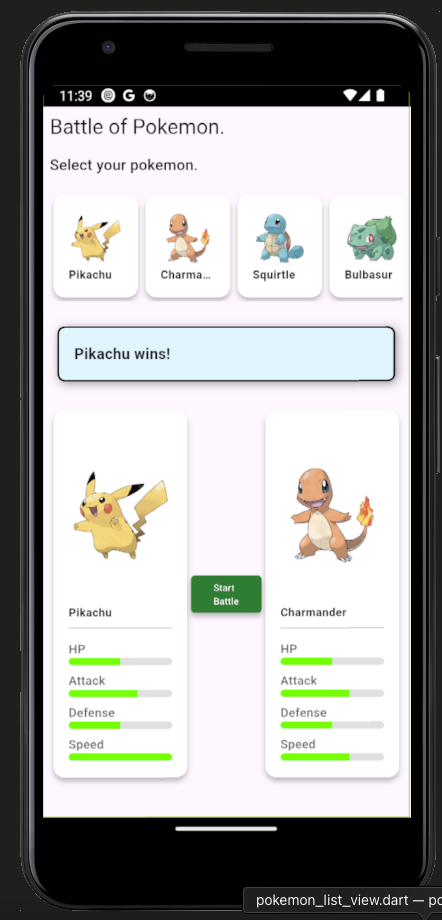
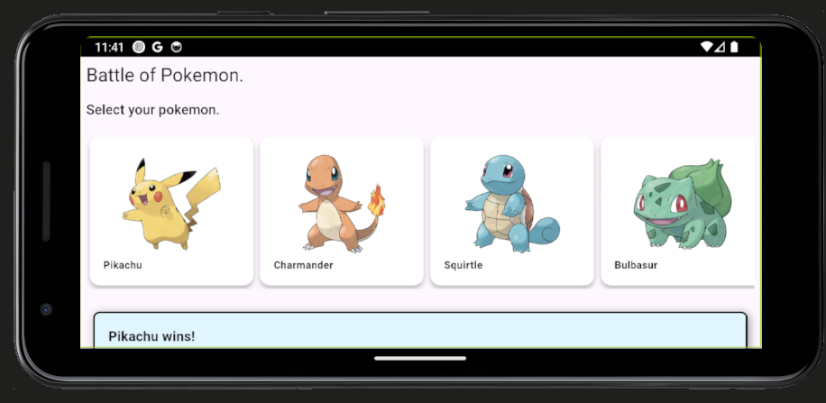

# Flutter Pokemon Battle

Proyecto desarrollado como prueba técnica. Aplicación móvil que permite seleccionar tu Pokémon y enfrentarte a un oponente aleatorio en una batalla dinámica, con una interfaz intuitiva, amigable y fácil de usar.

---

# Características

- Selecciona uno de los Pokémon disponibles.
- Simula una batalla automática basada en sus estadísticas.
- Los oponentes se eligen aleatoriamente entre los Pokémon disponibles.

---

# Tecnologías utilizadas

- Flutter 3.29.2
- Go Router
- Providers
- Dio
- Cached network image

---

# Screenshots

<div align="center">
  
  </br>
  
</div>

---

# Configuración del proyecto

Requisitos

- [Flutter](https://docs.flutter.dev/get-started/install)
- [Git](https://git-scm.com/)

## Pasos para ejecutar la aplicación:

Descargar proyecto

```
git clone https://github.com/adrianferreiro/pokemon-battle-frontend.git
```

Posicionarse en la carpeta del proyecto

```
cd pokemon-battle-frontend
```

Obtener dependencias de Flutter

```
flutter pub get
```

Ejecutar proyecto

```
flutter run
```
